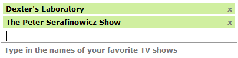
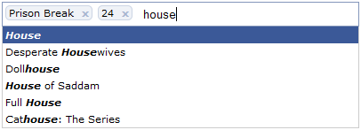

Instant Demo
------------
<input type="text" id="tokeninput-demo" />

Start typing TV show names in the box above. 
More demos can be found [here](demo.html).

Overview
--------
Tokeninput is a jQuery plugin which allows your users to select multiple items
from a predefined list, using autocompletion as they type to find each item.
You may have seen a similar type of text entry when filling in the recipients 
field sending messages on facebook.

Features
--------
- Intuitive UI for selecting multiple items from a large list
- Easy to skin/style purely in css, no images required
- Supports any backend which can generate JSON, including PHP, Rails, Django, ASP.net
- Smooth animations when results load
- Select, delete and navigate items using the mouse or keyboard
- Client-side result caching to reduce server load
- Crossdomain support via JSONP
- Callbacks when items are added or removed from the list
- Preprocess results from the server with the onResult callback
- Programatically add, remove, clear and get tokens

Screenshots
-----------

Vertical list style item selection

Facebook style item selection

Installation & Setup
--------------------

### Create a server-side script to handle search requests ###

Create a server-side script (PHP, Rails, ASP.net, etc) to generate your
search results. The script can fetch data from wherever you like, for
example a database or a hardcoded list. Your script must accept a GET parameter
named `q` which will contain the term to search for. E.g.
http://www.example.com/myscript?q=query

Your script should output JSON search results in the following format:

[
    {"id":"856","name":"House"},
    {"id":"1035","name":"Desperate Housewives"},
    ...
]


### Include and initialize the plugin ###

Include jQuery and Tokeninput Javascript and stylesheet files on your page, and
attach to your text input:
Tokeninput stylesheet:


<link rel="stylesheet" type="text/css" href="yourfiles/token-input.css" />



Configuration
-------------
The tokeninput takes an optional second parameter on intitialization which
allows you to customize the appearance and behaviour of the script, as well as
add your own callbacks to intercept certain events. The following options are
available:

hintText
:   The text to show in the dropdown label which appears when you first click 
    in the search field. *default: "Type in a search term"*
    [(demo)](demo.html#custom-labels).

noResultsText
:   The text to show in the dropdown label when no results are found which 
    match the current query. *default: "No results"*
    [(demo)](demo.html#custom-labels).

searchingText
:   The text to show in the dropdown label when a search is currently in
    progress. *default: "Searching..."* [(demo)](demo.html#custom-labels).

deleteText
:   The text to show on each token which deletes the token when clicked.
    *default: &times;* [(demo)](demo.html#custom-delete).

theme
:   Set this to a string, eg "facebook" when including theme css files to set
    the css class suffix [(demo)](demo.html#theme).

animateDropdown
:   Set this to `false` to disable animation of the dropdown *default: true*
    [(demo)](demo.html#disable-animation).

searchDelay
:   The delay, in milliseconds, between the user finishing typing and the
    search being performed. *default: 300* [(demo)](demo.html#custom-limits).

minChars
:   The minimum number of characters the user must enter before a search is
    performed. *default: 1* [(demo)](demo.html#custom-limits).

tokenLimit
:   The maximum number of results allowed to be selected by the user. Use 
    `null` to allow unlimited selections. *default: null*
    [(demo)](demo.html#custom-limits).

tokenValue
:   The value of the token input when the input is submitted. Set it to `id`
    in order to get a concatenation of token IDs, or to `name` in order to
    get a concatenation of names. *default: id*

prePopulate
:   Prepopulate the tokeninput with existing data. Set to an array of JSON
    objects, eg: `[{id: 3, name: "test", id: 5, name: "awesome"}]`
    to pre-fill the input. *default: null* [(demo)](demo.html#pre-populated).

preventDuplicates
:   Prevent user from selecting duplicate values by setting this to `true`.
    *default: false* [(demo)](demo.html#prevent-duplicates).

jsonContainer
:   The name of the json object in the response which contains the search
    results. Use `null` to use the top level response object. *default: null*.

method
:   The HTTP method (eg. GET, POST) to use for the server request. *default:
    "GET"*.

queryParam
:   The name of the query param which you expect to contain the search term
    on the server-side. *default: "q"*.

crossDomain
:   Use JSONP cross-domain communication to the server instead of a normal
    ajax request. *default: false*.

onResult
:   A function to call whenever we receive results back from the server. You 
    can use this function to pre-process results from the server before they
    are displayed to the user. *default: null*
    [(demo)](demo.html#onresult).

onAdd
:   A function to call whenever the user adds another token to their
    selections. *defaut: null* [(demo)](demo.html#onadd-ondelete).

onDelete
:   A function to call whenever the user removes a token from their selections.
    *default: null* [(demo)](demo.html#onadd-ondelete).

Methods
-------
`selector.tokenInput("add", {id: x, name: y});`
:   Add a new token to the tokeninput with id `x` and name `y`.

`selector.tokenInput("remove", {id: x});`
:   Remove the tokens with id `x` from the tokeninput.

`selector.tokenInput("remove", {name: y});`
:   Remove the tokens with name `y` from the tokeninput.

`selector.tokenInput("clear");`
:   Clear all tokens from the tokeninput.

`selector.tokenInput("get");`
:   Gets the array of selected tokens from the tokeninput (each item being an object of the kind `{id: x, name: y}`).

Reporting Bugs or Feature Requests
----------------------------------
Please report any bugs or feature requests on the github issues page for this
project here:

<https://github.com/loopj/jquery-tokeninput/issues>

License
-------
Tokeninput is released under a dual license. You can choose either the GPL or
MIT license depending on the project you are using it in and how you wish to
use it.